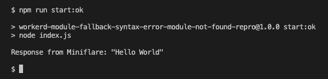
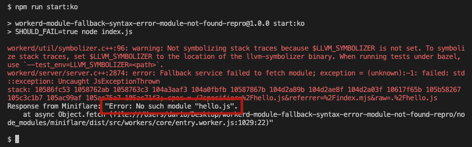

# Workerd module fallback syntax error module not found repro

## Steps to reproduce the issue

### Install the dependencies
```sh
$ npm i
```

### Run `start:ok`
```sh
$ npm run start:ok
```
this presents the following output showing that the module is present and correctly handled:


### Run `start:ko`
```sh
$ npm run start:ko
```
this presents the following error saying that the module could not be found:


note that the only thing that
changed is the content of the module, so ideally the error should show that the module was found
but not correctly built (instead of saying that it wasn't found)

